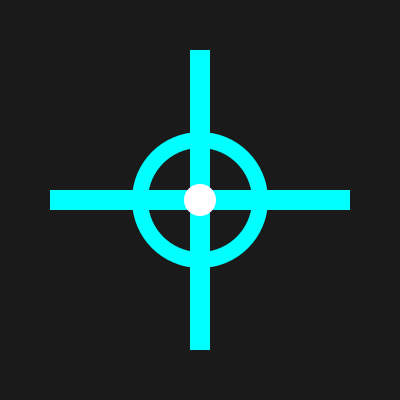
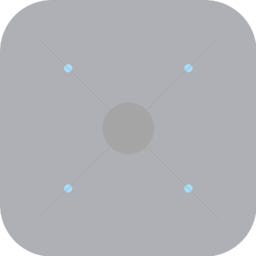

# SHOOTER

<p align="center">
  
</p>

<p align="center">
  <em>AI-powered code targeting and notification system</em>
</p>

<p align="center">
  <a href="https://github.com/yourusername/shooter/blob/main/LICENSE">
    
  </a>
  <a href="https://github.com/yourusername/shooter/actions">
    
  </a>
  <a href="https://github.com/yourusername/shooter/releases">
    
  </a>
</p>

---

## 🎯 **What is SHOOTER?**

SHOOTER is an intelligent code monitoring and notification system that bridges the gap between development tools and real-time awareness. Using AI-powered targeting capabilities, SHOOTER automatically detects code changes, analyzes development patterns, and delivers precise notifications to iOS devices.

### **Key Features**

- **🤖 AI-Powered Targeting**: Intelligent code scanning and pattern recognition
- **📱 iOS Integration**: Native push notifications with interactive responses
- **⚡ Real-time Monitoring**: Continuous development environment awareness
- **🎯 Precision Delivery**: Context-aware notification targeting
- **🔧 Developer-Friendly**: Seamless integration with existing workflows

## 🚀 **Quick Start**

### **Prerequisites**

- **Bun runtime** (v1.2.19+) - ✅ **Primary runtime** (20-30x faster than Node.js)
- iOS device with push notification capability
- Apple Developer account (for APNs)

### **Installation**

```bash
# Install dependencies
bun install

# Configure environment
cp .env.example .env
# Edit .env with your APNs credentials and settings

# Run development server
bun run dev
```

### **iOS App Setup**

1. Open the iOS project in Xcode:
   ```bash
   cd ios/Shooter
   open Shooter.xcodeproj
   ```

2. Configure your team and bundle identifier
3. Build and install on your iOS device
4. Allow push notifications when prompted

## 📱 **iOS Integration**

The SHOOTER iOS app provides:

- **Push Notification Reception**: Receive real-time development alerts
- **Interactive Notifications**: Respond to code events directly from notifications
- **Notification History**: Track all development events and responses
- **Custom Configuration**: Personalize notification preferences and filters

### **Supported Notification Types**

- Code file changes and modifications
- Build status and compilation events
- Error detection and debugging alerts
- Development milestone achievements
- Custom event triggers and patterns

## 🏗️ **Architecture**

SHOOTER consists of three main components:

1. **SvelteKit Server**: Central coordination and API endpoints
2. **iOS Application**: Native notification handling and user interface
3. **Development Hooks**: Code monitoring and event detection system

### **Technology Stack**

- **Backend**: SvelteKit, TypeScript, APNs
- **iOS**: Swift, SwiftUI, UserNotifications
- **Infrastructure**: Vercel, Cloudflare (optional)
- **Runtime**: **Bun v1.2.19** - Ultra-fast JavaScript runtime and package manager
- **Development**: Modern tooling with 20-30x performance improvements

## 🎨 **Brand Assets**

### **Icon Usage**

SHOOTER's holographic radar icon represents AI-powered code targeting:

- **Master SVG**: `assets/icons/shooter-icon-master.svg`
- **iOS Icons**: Complete set in `assets/icons/ios/`
- **Web Assets**: Favicons and PWA icons in `assets/icons/web/`
- **Social Media**: Platform-specific assets in `assets/icons/social/`

### **Brand Guidelines**

For detailed brand usage guidelines, see:
- [Brand Guidelines](docs/brand/BRAND-GUIDELINES.md)
- [Icon Specifications](docs/brand/ICON-SPECIFICATIONS.md)
- [Implementation Checklist](docs/brand/IMPLEMENTATION-CHECKLIST.md)

## 📖 **Documentation**

### **Current Implementation**

- [CLAUDE.md](CLAUDE.md) - Complete project overview and current state
- [Comprehensive Implementation Guide](docs/COMPREHENSIVE_IMPLEMENTATION_GUIDE.md)
- [Storage API Documentation](docs/STORAGE_API.md)
- [Testing and Verification Guide](docs/TESTING_AND_VERIFICATION_GUIDE.md)
- [Production Deployment Guide](docs/PRODUCTION_DEPLOYMENT_GUIDE.md)
- [CSS Style Guide](docs/CSS_STYLE_GUIDE.md)
- [Claude Code Integration](CLAUDE-CODE-INTEGRATION.md)

### **Future Roadmap**

- [WebView iOS Architecture Plan](WEB-FIRST-ARCHITECTURE-PLAN.md)
- [Claude Code Templates Integration](CLAUDE-CODE-TEMPLATES-INTEGRATION.md)
- [Next Phases Roadmap](NEXT-PHASES.md)

### **Historical Reference**

- [Archive](memory-bank/archive/) - Completed phases and implementation plans
- [Phase 5 Summary](docs/PHASE_5_IMPLEMENTATION_SUMMARY.md) - ✅ **COMPLETE** - Production readiness achieved

**Phase 5 Achievements** (Completed):
- Production-ready storage system (Redis → Database → Memory fallback)
- Unified CSS design system with mobile-first responsive design
- Automated screenshot generation for visual regression testing
- Comprehensive testing suite (17/17 verification tests passing)
- Production deployment configs (Docker, Kubernetes, Terraform)
- Performance monitoring and health checks

**Note**: Authentication system has been removed. The application no longer includes authentication routes.


## 🔧 **Configuration**

### **Environment Variables**

```bash
# APNs Configuration
APNS_KEY_ID=your_key_id
APNS_TEAM_ID=your_team_id
APNS_BUNDLE_ID=com.yourcompany.shooter
APNS_PRIVATE_KEY=path_to_private_key.p8

# Server Configuration
PORT=3000
NODE_ENV=production
API_SECRET=your_api_secret

# Optional: Database Configuration
DATABASE_URL=postgresql://...
REDIS_URL=redis://...
```

### **Development Setup**

1. **Install Bun**: Download from [bun.sh](https://bun.sh) (v1.2.19+)
2. **Configure APNs**: Set up Apple Push Notification service credentials
3. **iOS Device Setup**: Install and configure the iOS companion app
4. **Development Hooks**: Integrate with your development environment
5. **Testing**: Verify end-to-end notification delivery

### **Bun Commands Reference**

#### **Project Setup**
```bash
# Install all dependencies (20-30x faster than npm)
bun install

# Install specific packages
bun add <package-name>
bun add -d <dev-package-name>

# Remove packages
bun remove <package-name>
```

#### **Development Commands**
```bash
# Start development server (port 7777)
bun dev

# Alternative development commands
bun run dev              # Full command
bun run dev --port 8080  # Custom port
```

#### **Build and Production**
```bash
# Build for production
bun run build

# Start production server
bun run start

# Preview production build
bun run preview
```

#### **Testing Commands**
```bash
# Run all tests
bun test

# Run tests in watch mode
bun test --watch

# Run tests with coverage
bun test --coverage

# Run integration tests
bun run test:integration

# Run production verification
bun run test:production
```

#### **Code Quality**
```bash
# Run TypeScript checks
bun run check

# Format code (if configured)
bun run format

# Lint code (if configured)
bun run lint
```

## 🧪 **Testing**

### **Run Test Suite**

```bash
# Unit tests
bun test

# Integration tests
bun run test:integration

# Production verification
bun run test:production
```

### **Manual Testing**

```bash
# Test notification delivery
curl -X POST http://localhost:3000/api/notify \
  -H "Content-Type: application/json" \
  -H "Authorization: Bearer your_token" \
  -d '{"message": "Test notification", "priority": "high"}'
```

## 🚀 **Deployment**

### **Production Deployment**

1. **Vercel Deployment** (Recommended):
   ```bash
   vercel deploy --prod
   ```

2. **Docker Deployment**:
   ```bash
   docker-compose up -d
   ```

3. **Kubernetes Deployment**:
   ```bash
   kubectl apply -f deployment/kubernetes/
   ```

### **Infrastructure Options**

- **Vercel**: Serverless deployment with edge functions
- **Docker**: Containerized deployment for any platform
- **Kubernetes**: Scalable orchestration for enterprise use
- **Self-hosted**: Traditional server deployment

## 🤝 **Contributing**

We welcome contributions to SHOOTER! Please see our contributing guidelines:

1. Fork the repository
2. Create a feature branch (`git checkout -b feature/amazing-feature`)
3. Commit your changes (`git commit -m 'Add amazing feature'`)
4. Push to the branch (`git push origin feature/amazing-feature`)
5. Open a Pull Request

### **Development Guidelines**

- Follow TypeScript best practices
- Include tests for new features
- Update documentation as needed
- Follow the established code style
- Test on both iOS and server components

## 📄 **License**

This project is licensed under the MIT License - see the [LICENSE](LICENSE) file for details.

## 🆘 **Support**

- **Issues**: [GitHub Issues](https://github.com/yourusername/shooter/issues)
- **Discussions**: [GitHub Discussions](https://github.com/yourusername/shooter/discussions)
- **Documentation**: [Project Wiki](https://github.com/yourusername/shooter/wiki)

## 🏆 **Acknowledgments**

- **Powered by [Bun](https://bun.com)** - Ultra-fast JavaScript runtime (v1.2.19) ✅ **MIGRATED**
- Built with [SvelteKit](https://kit.svelte.dev) for modern web development
- iOS integration using [Swift](https://swift.org) and native frameworks
- Icon design inspired by holographic radar interfaces
- **Performance**: 20-30x faster development with Bun migration completed January 2025

---

<p align="center">
  
</p>

<p align="center">
  <em>Precision targeting for the modern developer</em>
</p>